# ApiFox Demo

## 团队协作（团队和项目）

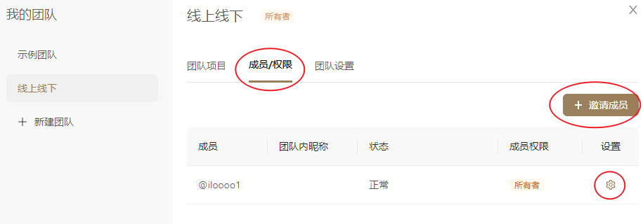

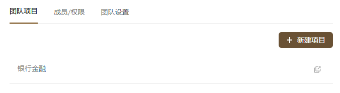

官方推荐团队协作流程

> 1. **前端**（或**后端**）在 **[Apifox](https://www.apifox.cn/)** 上定好`接口文档`初稿。
> 2. **前后端** 一起评审、完善`接口文档`，定好`接口用例`。
> 3. **前端** 使用系统根据接口文档自动生成的 `Mock 数据`进入开发，无需手写 mock 规则。
> 4. **后端** 使用`接口用例` 调试开发中接口，只要所有接口用例调试通过，接口就开发完成了。如开发过中接口有变化，调试的时候就自动更新了文档，零成本的保障了接口维护的及时性。
> 5. **后端** 每次调试完一个功能就保存为一个`接口用例`。
> 6. **测试人员** 直接使用`接口用例`测试接口。
> 7. 所有接口开发完成后，**测试人员**（也可以是**后端**）使用`集合测试`功能进行多接口集成测试，完整测试整个接口调用流程。
> 8. **前后端** 都开发完，前端从`Mock 数据`切换到`正式数据`，联调通常都会非常顺利，因为前后端双方都完全遵守了接口定义的规范。

## 项目概览

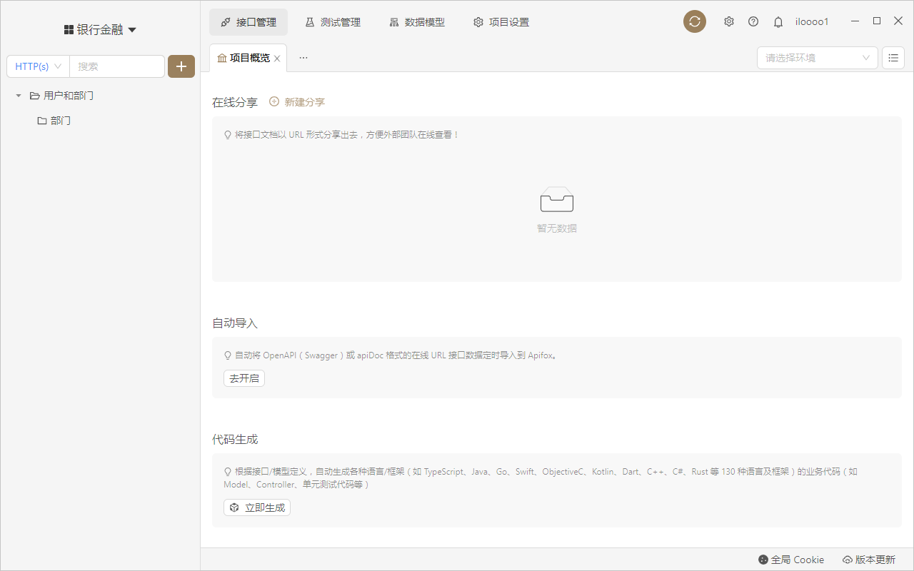

## 接口定义

### 基本信息

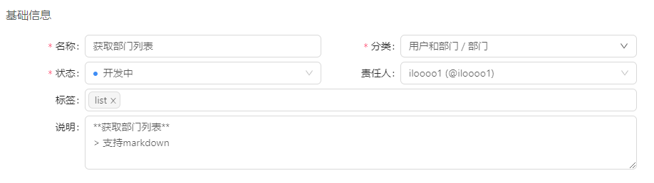

### 请求参数

支持JSON/XML导入

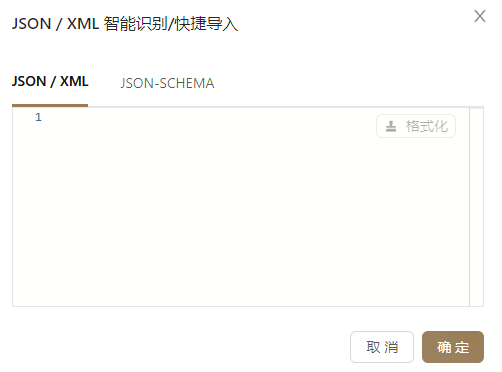

####  &#x2B50; Mock功能：

> 参考：[软件官方Mock教程](https://www.apifox.cn/help/app/mock/mock-rules/#基本写法)

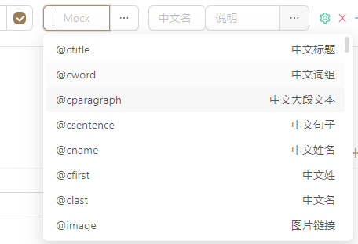

请求参数：

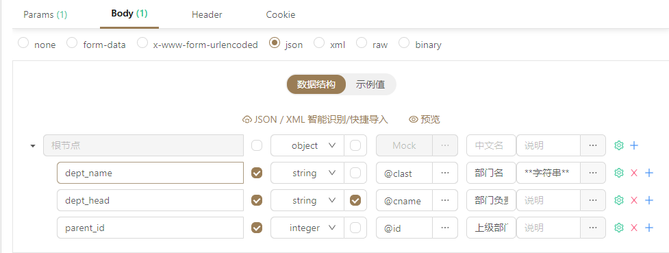

高级设置

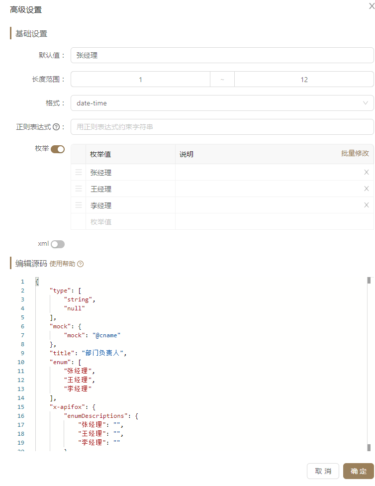

### 返回参数

#### &#x2B50; 全局参数

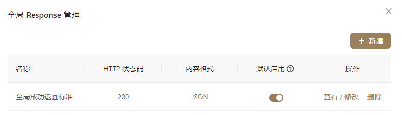

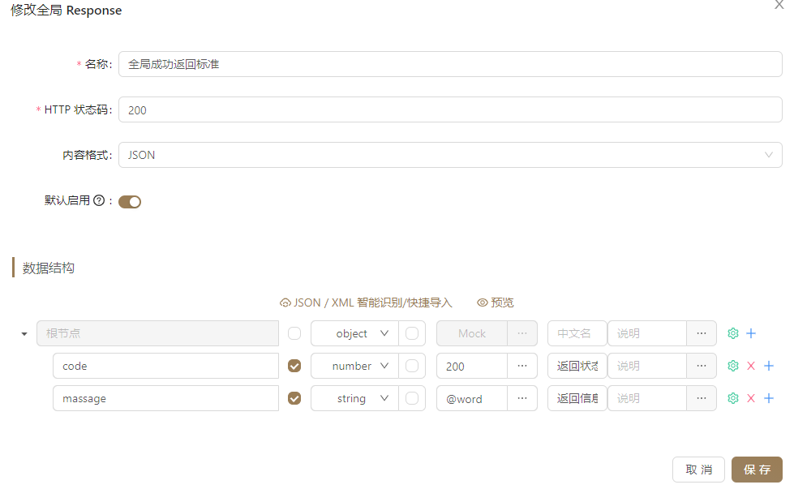

#### 返回示例

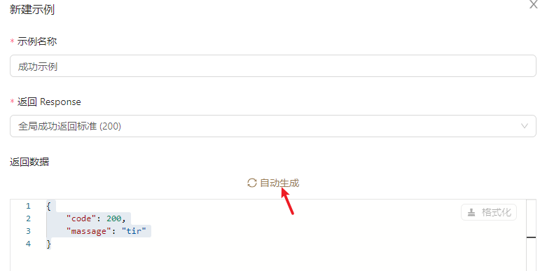

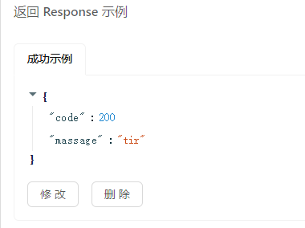

拓展

> 登录态（Auth）处理
> 接口签名如何处理
> 
>https://www.apifox.cn/help/app/best-practices/api-signature/
> 

## 运行测试

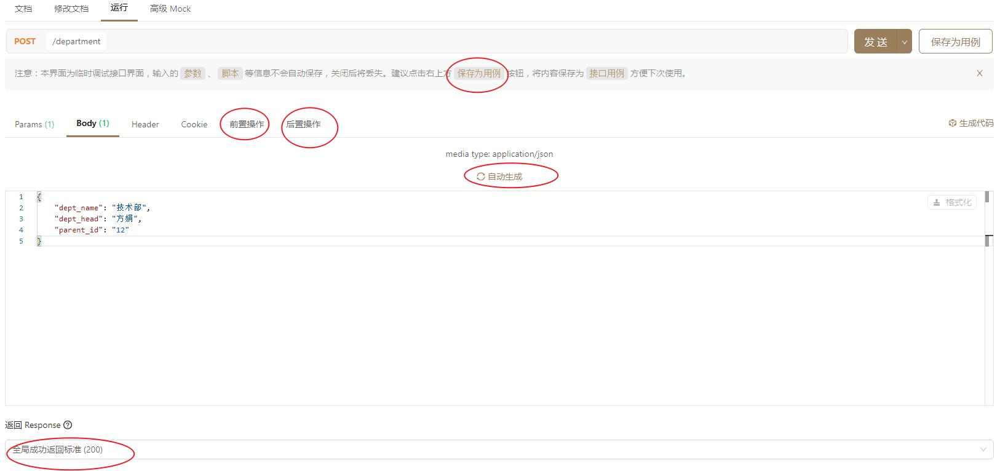

### 前置后置操作

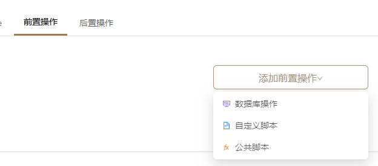

### &#x2B50;环境（媲美Postman）

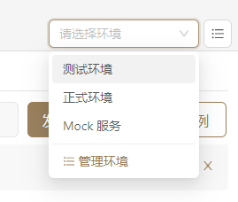

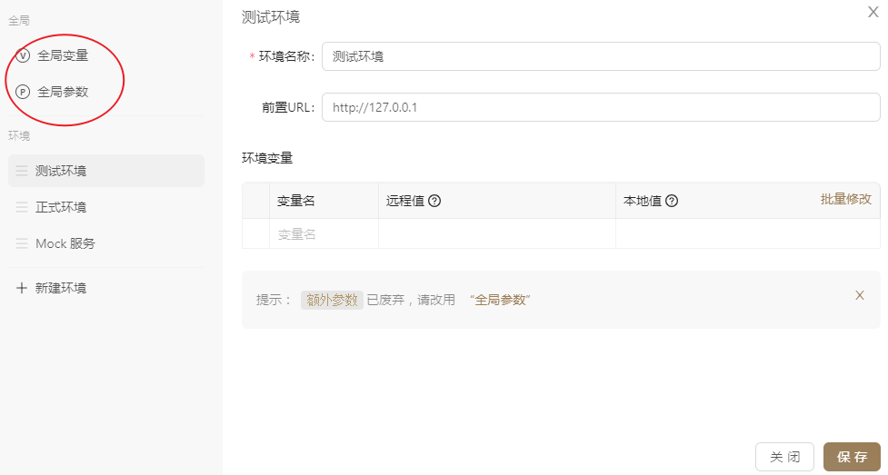

### &#x2B50;Mock 测试

> 参考：[软件官方解释](https://www.apifox.cn/help/app/mock/)

官方示例参考：

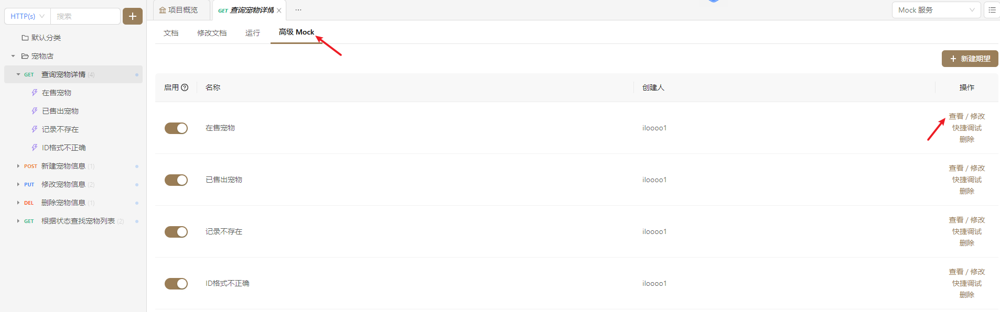

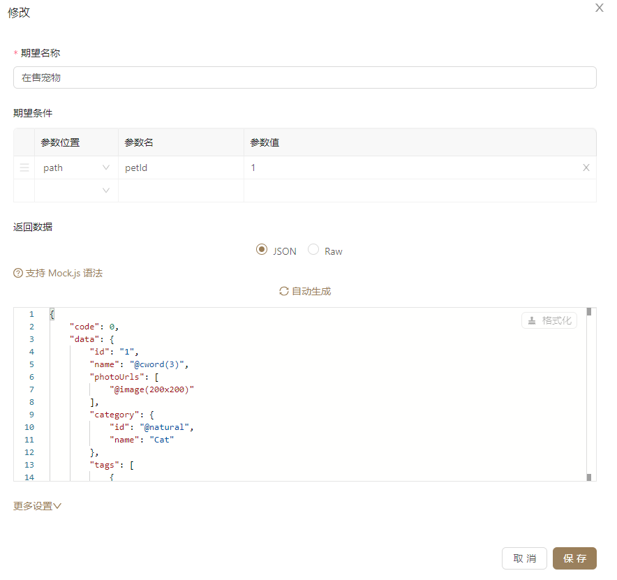

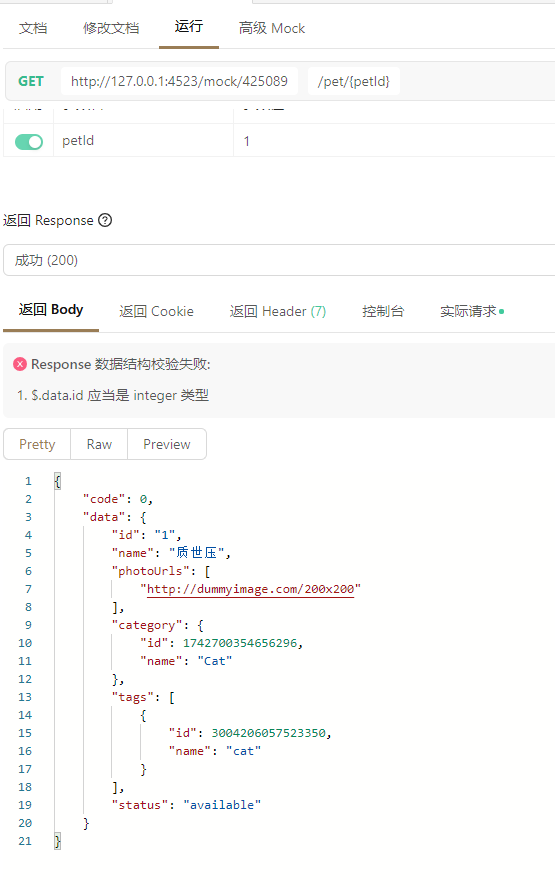

### 测试管理（结合Mock做回归测试、单元测试）

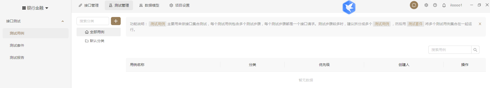

##### 支持导出 JMeter 测试、Apifox CLI`、`Postman

## 代码生成

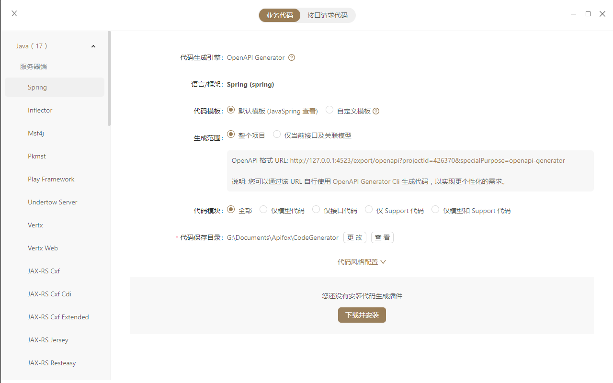

&#x1F628; Swagger OpenAPI 风格，和平时代码风格有出入

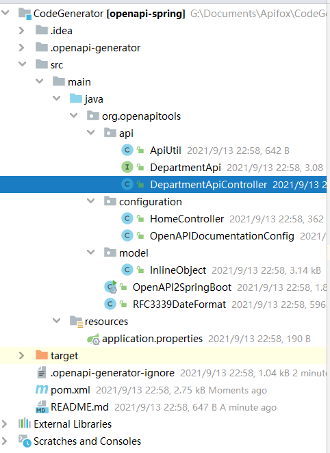

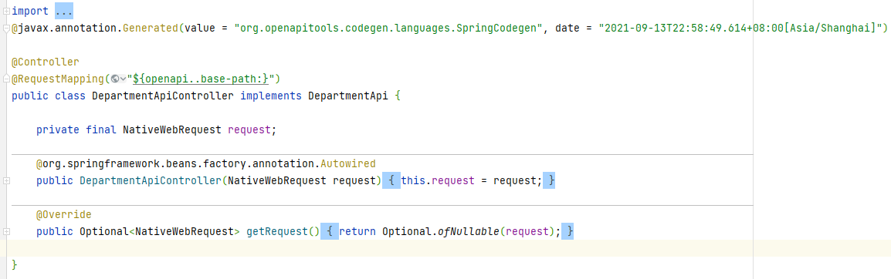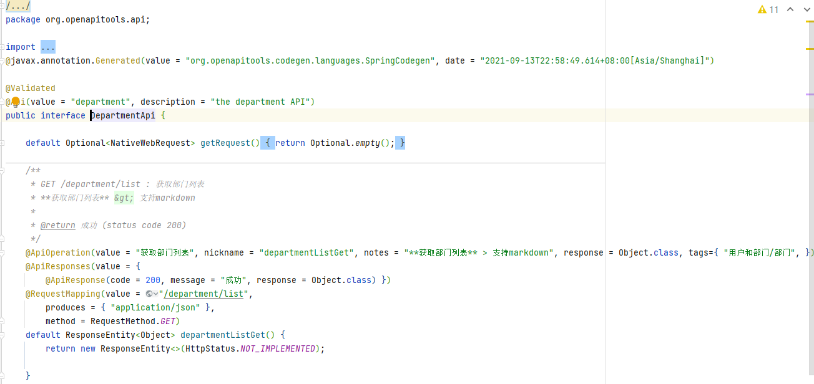

### &#x2B50;自定义模板

虽然有学习成本，如果能自定义符合我司开发人员风格习惯的模板，可以快速生成规范代码

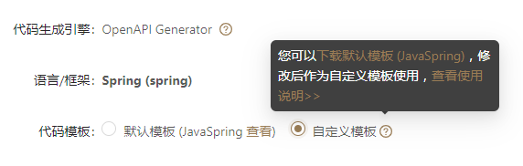

> https://openapi-generator.tech/
>
> https://openapi-generator.tech/docs/customization

## 总结

整体来说很好用。团队协作感觉挺好用，不过因为是商业软件，不确定实际使用时产生收费问题。学习成本适中，集中在Mock功能和前后置操作。工作量上集中在项目初始阶段和项目测试，集中在定义全局参数，全局返回示例，和各种测试实例。目前发现的缺点是会有点bug，比如最大化时代码生成页面有问题，功能还可以更丰富，比如没有自动保存功能等。

代码生成功能需要自定义模板，暂时无法直接使用。

