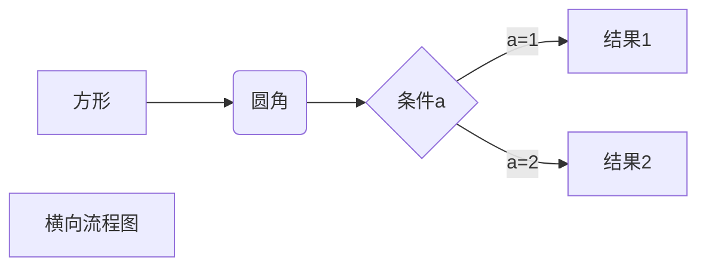
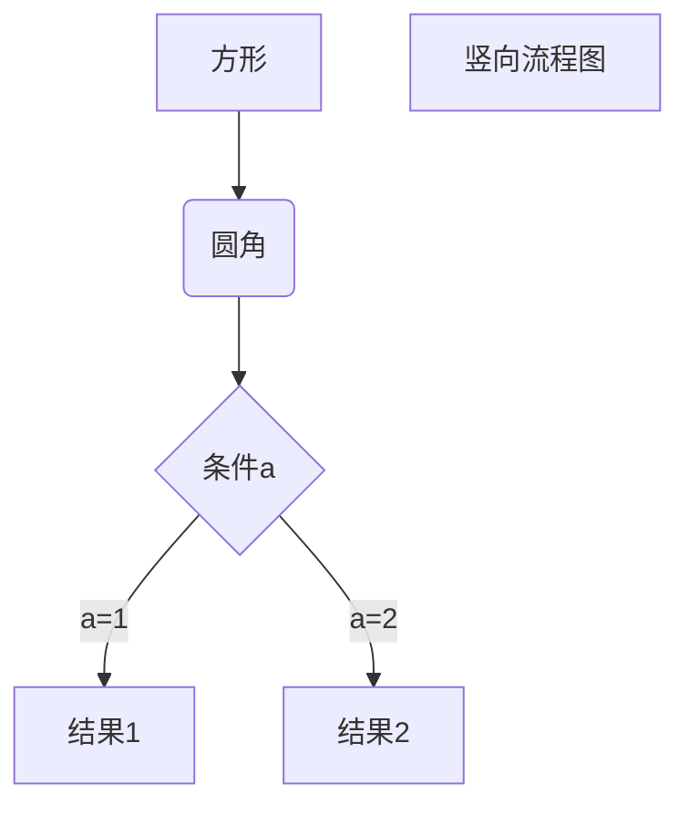
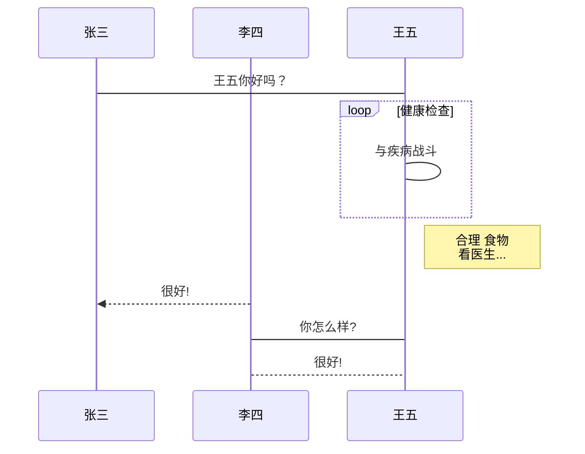
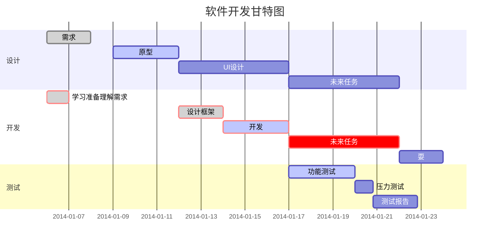

# markdown 代码和效果对应

# Markdown 目录

[toc]

```markdown
[toc]
```

# Markdown 标题

# h1 标题示例

```markdown
# h1 标题示例
```

```HTML
<h1>h1 标题示例</h1>
```

## h2 标题示例

````markdown h2 标题
## h2 标题示例
````

```HTML
<h2>h2 标题示例</h2>
```

### h3 标题示例

```markdown
### h3 标题示例
```

```HTML
<h3>h3 标题示例</h3>
```

#### h4 标题示例

```markdown
#### h4 标题示例
```

```HTML
<h4>h4 标题示例</h4>
```

##### h5 标题示例

```markdown
##### h5 标题示例
```

```HTML
<h5>h5 标题示例</h5>
```

###### h6 标题示例

```markdown
###### h6 标题示例
```

```HTML
<h6>h6 标题示例</h6>
```

# Markdown 段落

````markdown
段落末尾用两个以上空行加回车或者段落后面使用一个空行来表示重新开始一个段落。
````

## 字体

````markdown
*斜体文本*
_斜体文本_
**粗体文本**
__粗体文本__
***粗斜体文本***
___粗斜体文本___
````

````html
<p>斜体文本</p>
<p><strong>粗体文本</strong></p>
<p>粗斜体文本</p>
````

斜体文本

**粗体文本**

***粗斜体文本***

## 分隔线

````markdown
***
* * *
*****
- - -
----------
````

```HTML
div.hr:focus {cursor: none;}
hr {
    height: 2px;
    padding: 0;
    margin: 16px 0;
    background-color: #e7e7e7;
    border: 0 none;
    overflow: hidden;
    box-sizing: content-box;
}
<hr />
```

***
* * *
*****
- - -
----------

## 删除线

```markdown
~~删除线~~
```

````html
<p><del>删除线</del></p>
````

~~删除线~~

## 下划线

````markdown
<u>下划线</u>
````

<u>下划线</u>

## 脚注

```markdown
创建脚注格式类似这样 [^RUNOOB]。
[^RUNOOB]: 菜鸟教程 -- 学的不仅是技术，更是梦想！！！
```

````html
<p>创建脚注格式类似这样 <sup class='md-footnote'><a href='#dfref-footnote-1' name='ref-footnote-1'>1</a></sup>。</p>
<div class='footnote-line'><span class='md-fn-count'>1</span> 菜鸟教程 -- 学的不仅是技术，更是梦想！！！ <a name='dfref-footnote-1' href='#ref-footnote-1' title='回到文档' class='reversefootnote' >↩</a></div>
````

创建脚注格式类似这样 [^RUNOOB]。

[^RUNOOB]: 菜鸟教程 -- 学的不仅是技术，更是梦想！！！

# Markdown 列表

Markdown 支持有序列表和无序列表。

## 无序列表

使用星号(*****)、加号(**+**)或是减号(**-**)作为列表标记

````markdown
* 第一项
* 第二项
* 第三项

+ 第一项
+ 第二项
+ 第三项

- 第一项
- 第二项
- 第三项
````

````html
<ul>
<li>第一项</li>
<li>第二项</li>
<li>第三项</li>
</ul>
````

* 第一项
* 第二项
* 第三项

## 有序列表

````markdown
1. 第一项
2. 第二项
3. 第三项
````

````html
<ol>
<li>第一项</li>
<li>第二项</li>
<li>第三项</li>
</ol>
````

1. 第一项
2. 第二项
3. 第三项

## 列表嵌套

````markdown
1. 第一项：
    - 第一项嵌套的第一个元素
    - 第一项嵌套的第二个元素
2. 第二项：
    - 第二项嵌套的第一个元素
    - 第二项嵌套的第二个元素
````

````html
<ol>
<li><p>第一项：</p>
<ul>
<li>第一项嵌套的第一个元素</li>
</ul>
<ul>
<li>第一项嵌套的第二个元素</li>
</ul>
</li>
<li><p>第二项：</p>
<ul>
<li>第二项嵌套的第一个元素</li>
<li>第二项嵌套的第二个元素</li>
</ul>
</li>
</ol>
````

1. 第一项：
    * 第一项嵌套的第一个元素

    - 第一项嵌套的第二个元素
2. 第二项：
    - 第二项嵌套的第一个元素
    - 第二项嵌套的第二个元素

# Markdown 区块

Markdown 区块引用是在段落开头使用 **>** 符号 ，然后后面紧跟一个**空格**符号：

```markdown
> 最外层
> > 第一层嵌套
> > > 第二层嵌套
```

```HTML
<p>最外层</p>
<blockquote><p>第一层嵌套</p>
<blockquote><p>第二层嵌套</p>
</blockquote>
</blockquote>
```

> 最外层
>
> > 第一层嵌套
> >
> > > 第二层嵌套

# Markdown 代码

## 函数或片段的代码

````markdown
`printf()` 函数
````

```HTML
<code>printf()</code> 函数
```

`printf()` 函数

## 代码区块

代码区块使用 **4 个空格**或者一个**制表符（Tab 键）**

也可以用 **```** 包裹一段代码，并指定一种语言（也可以不指定）

```markdown
​```javascript
$(document).ready(function () {
    alert('RUNOOB');
});
​```
```

```html
   <pre spellcheck="false" class="md-fences md-end-block ty-contain-cm modeLoaded" lang="javascript">
    <div class="CodeMirror cm-s-inner CodeMirror-wrap" lang="javascript">
     <div style="overflow: hidden; position: relative; width: 3px; height: 0px; top: 0px; left: 8px;">
      <textarea autocorrect="off" autocapitalize="off" spellcheck="false" tabindex="0" style="position: absolute; bottom: -1em; padding: 0px; width: 1000px; height: 1em; outline: none;"></textarea>
     </div>
     <div class="CodeMirror-scrollbar-filler" cm-not-content="true"></div>
     <div class="CodeMirror-gutter-filler" cm-not-content="true"></div>
     <div class="CodeMirror-scroll" tabindex="-1">
      <div class="CodeMirror-sizer" style="margin-left: 0px; margin-bottom: 0px; border-right-width: 0px; padding-right: 0px; padding-bottom: 0px;">
       <div style="position: relative; top: 0px;">
        <div class="CodeMirror-lines" role="presentation">
         <div role="presentation" style="position: relative; outline: none;">
          <div class="CodeMirror-measure">
           <pre>x</pre>
          </div>
          <div class="CodeMirror-measure"></div>
          <div style="position: relative; z-index: 1;"></div>
          <div class="CodeMirror-code" role="presentation">
           <div class="CodeMirror-activeline" style="position: relative;">
            <div class="CodeMirror-activeline-background CodeMirror-linebackground"></div>
            <div class="CodeMirror-gutter-background CodeMirror-activeline-gutter" style="left: 0px; width: 0px;"></div>
            <pre class=" CodeMirror-line " role="presentation"><span role="presentation" style="padding-right: 0.1px;"><span class="cm-variable">$</span>(<span class="cm-variable">document</span>).<span class="cm-property">ready</span>(<span class="cm-keyword">function</span> () {</span></pre>
           </div>
           <div class="" style="position: relative;">
            <pre class=" CodeMirror-line " role="presentation"><span role="presentation" style="padding-right: 0.1px;"> &nbsp; &nbsp;<span class="cm-variable">alert</span>(<span class="cm-string">'RUNOOB'</span>);</span></pre>
           </div>
           <div class="" style="position: relative;">
            <pre class=" CodeMirror-line " role="presentation"><span role="presentation" style="padding-right: 0.1px;">});</span></pre>
           </div>
          </div>
         </div>
        </div>
       </div>
      </div>
      <div style="position: absolute; height: 0px; width: 1px; border-bottom: 0px solid transparent; top: 69px;"></div>
      <div class="CodeMirror-gutters" style="display: none; height: 69px;"></div>
     </div>
    </div></pre>
```

```javascript
$(document).ready(function () {
    alert('RUNOOB');
});
```

# Markdown 链接

```markdown
[链接名称](链接地址)
或者
<链接地址>
这是一个链接 [菜鸟教程](https://www.runoob.com)
```

```HTML
这是一个链接 <a href='https://www.runoob.com'>菜鸟教程</a>
```

这是一个链接 [菜鸟教程](https://www.runoob.com)

## 高级链接

```markdown
这个链接用 1 作为网址变量 [Google][1]
这个链接用 runoob 作为网址变量 [Runoob][runoob]
然后在文档的结尾为变量赋值（网址）
[1]: http://www.google.com/
[runoob]: http://www.runoob.com/
```

这个链接用 1 作为网址变量 [Google][1]
这个链接用 runoob 作为网址变量 [Runoob][runoob]
然后在文档的结尾为变量赋值（网址）

[1]: http://www.google.com/
[runoob]: http://www.runoob.com/

# Markdown 图片

```markdown


开头一个感叹号 !
接着一个方括号，里面放上图片的替代文字
接着一个普通括号，里面放上图片的网址，最后还可以用引号包住并加上选择性的 'title' 属性的文字。


```

```HTML
<p></p>
<p></p>
```


```markdown
 Markdown 还没有办法指定图片的高度与宽度，如果你需要的话，你可以使用普通的  标签。
 
```

```HTML
<p> </p>
```

 

# Markdown 表格

```markdown
Markdown 制作表格使用 | 来分隔不同的单元格，使用 - 来分隔表头和其他行
|  表头   | 表头  |
|  ----  | ----  |
| 单元格  | 单元格 |
| 单元格  | 单元格 |
```

```HTML
<figure><table>
<thead>
<tr><th>表头</th><th>表头</th></tr></thead>
<tbody><tr><td>单元格</td><td>单元格</td></tr><tr><td>单元格</td><td>单元格</td></tr></tbody>
</table></figure>
```

| 表头   | 表头   |
| ------ | ------ |
| 单元格 | 单元格 |
| 单元格 | 单元格 |

##  表格的对齐方式

```markdown
-: 设置内容和标题栏居右对齐。
:- 设置内容和标题栏居左对齐。
:-: 设置内容和标题栏居中对齐。
| 左对齐 | 右对齐 | 居中对齐 |
| :-----| ----: | :----: |
| 单元格 | 单元格 | 单元格 |
| 单元格 | 单元格 | 单元格 |
```

| 左对齐 | 右对齐 | 居中对齐 |
| :----- | -----: | :------: |
| 单元格 | 单元格 |  单元格  |
| 单元格 | 单元格 |  单元格  |

# Markdown 高级技巧

## 支持的 HTML 元素

不在 Markdown 涵盖范围之内的标签，都可以直接在文档里面用 HTML 撰写。

```markdown
目前支持的 HTML 元素有：<kbd> <b> <i> <em> <sup> <sub> <br>等
使用 <kbd>Ctrl</kbd>+<kbd>Alt</kbd>+<kbd>Del</kbd> 重启电脑
```

使用 <kbd>Ctrl</kbd>+<kbd>Alt</kbd>+<kbd>Del</kbd> 重启电脑

## 转义

```markdown
**文本加粗** 
\*\* 正常显示星号 \*\*
```

**文本加粗** 
\*\* 正常显示星号 \*\*

## 公式

```markdown
可以使用两个美元符 $$ 包裹 TeX 或 LaTeX 格式的数学公式来实现。提交后，问答和文章页会根据需要加载 Mathjax 对数学公式进行渲染
$$
\mathbf{V}_1 \times \mathbf{V}_2 =  \begin{vmatrix} 
\mathbf{i} & \mathbf{j} & \mathbf{k} \\
\frac{\partial X}{\partial u} &  \frac{\partial Y}{\partial u} & 0 \\
\frac{\partial X}{\partial v} &  \frac{\partial Y}{\partial v} & 0 \\
\end{vmatrix}
${$tep1}{\style{visibility:hidden}{(x+1)(x+1)}}
$$
```

$$
\mathbf{V}_1 \times \mathbf{V}_2 =  \begin{vmatrix} 
\mathbf{i} & \mathbf{j} & \mathbf{k} \\
\frac{\partial X}{\partial u} &  \frac{\partial Y}{\partial u} & 0 \\
\frac{\partial X}{\partial v} &  \frac{\partial Y}{\partial v} & 0 \\
\end{vmatrix}
${$tep1}{\style{visibility:hidden}{(x+1)(x+1)}}
$$

## Typora 画流程图、时序图(顺序图)、甘特图

`Typora` --> **`视图`** --> **`源码模式`**  or <kbd>Ctrl</kbd>+<kbd>/</kbd>

```markdown
1、横向流程图源码格式：
​```mermaid
graph LR
A[方形] -->B(圆角)
    B --> C{条件a}
    C -->|a=1| D[结果1]
    C -->|a=2| E[结果2]
    F[横向流程图]
​```
```

### 1、横向流程图源码格式



```markdown
2、竖向流程图源码格式：
​```mermaid
graph TD
A[方形] --> B(圆角)
    B --> C{条件a}
    C --> |a=1| D[结果1]
    C --> |a=2| E[结果2]
    F[竖向流程图]
​```
```

### 2、竖向流程图源码格式



```markdown
3、标准流程图源码格式：
​```flow
st=>start: 开始框
op=>operation: 处理框
cond=>condition: 判断框(是或否?)
sub1=>subroutine: 子流程
io=>inputoutput: 输入输出框
e=>end: 结束框
st->op->cond
cond(yes)->io->e
cond(no)->sub1(right)->op
​```
```

### 3、标准流程图源码格式

```flow
st=>start: 开始框
op=>operation: 处理框
cond=>condition: 判断框(是或否?)
sub1=>subroutine: 子流程
io=>inputoutput: 输入输出框
e=>end: 结束框
st->op->cond
cond(yes)->io->e
cond(no)->sub1(right)->op
```

```markdown
4、标准流程图源码格式（横向）：
​```flow
st=>start: 开始框
op=>operation: 处理框
cond=>condition: 判断框(是或否?)
sub1=>subroutine: 子流程
io=>inputoutput: 输入输出框
e=>end: 结束框
st(right)->op(right)->cond
cond(yes)->io(bottom)->e
cond(no)->sub1(right)->op
​```
```

### 4、标准流程图源码格式（横向）

```flow
st=>start: 开始框
op=>operation: 处理框
cond=>condition: 判断框(是或否?)
sub1=>subroutine: 子流程
io=>inputoutput: 输入输出框
e=>end: 结束框
st(right)->op(right)->cond
cond(yes)->io(bottom)->e
cond(no)->sub1(right)->op
```

```markdown
5、UML时序图源码样例：
​```sequence
对象A->对象B: 对象B你好吗?（请求）
Note right of 对象B: 对象B的描述
Note left of 对象A: 对象A的描述(提示)
对象B-->对象A: 我很好(响应)
对象A->对象B: 你真的好吗？
​```
```

### 5、UML时序图源码样例

```sequence
对象A->对象B: 对象B你好吗?（请求）
Note right of 对象B: 对象B的描述
Note left of 对象A: 对象A的描述(提示)
对象B-->对象A: 我很好(响应)
对象A->对象B: 你真的好吗？
```

```markdown
6、UML时序图源码复杂样例：
​```sequence
Title: 标题：复杂使用
对象A->对象B: 对象B你好吗?（请求）
Note right of 对象B: 对象B的描述
Note left of 对象A: 对象A的描述(提示)
对象B-->对象A: 我很好(响应)
对象B->小三: 你好吗
小三-->>对象A: 对象B找我了
对象A->对象B: 你真的好吗？
Note over 小三,对象B: 我们是朋友
participant C
Note right of C: 没人陪我玩
​```
```

### 6、UML时序图源码复杂样例

```sequence
Title: 标题：复杂使用
对象A->对象B: 对象B你好吗?（请求）
Note right of 对象B: 对象B的描述
Note left of 对象A: 对象A的描述(提示)
对象B-->对象A: 我很好(响应)
对象B->小三: 你好吗
小三-->>对象A: 对象B找我了
对象A->对象B: 你真的好吗？
Note over 小三,对象B: 我们是朋友
participant C
Note right of C: 没人陪我玩
```

```markdown
7、UML标准时序图样例：
​```mermaid
%% 时序图例子,-> 直线，-->虚线，->>实线箭头
  sequenceDiagram
    participant 张三
    participant 李四
    张三->王五: 王五你好吗？
    loop 健康检查
        王五->王五: 与疾病战斗
    end
    Note right of 王五: 合理 食物 <br/>看医生...
    李四-->>张三: 很好!
    王五->李四: 你怎么样?
    李四-->王五: 很好!
​```
```

### 7、UML标准时序图样例



```markdown
8、甘特图样例：
​```mermaid
%% 语法示例
        gantt
        dateFormat  YYYY-MM-DD
        title 软件开发甘特图
        section 设计
        需求                      :done,    des1, 2014-01-06,2014-01-08
        原型                      :active,  des2, 2014-01-09, 3d
        UI设计                     :         des3, after des2, 5d
    未来任务                     :         des4, after des3, 5d
        section 开发
        学习准备理解需求                      :crit, done, 2014-01-06,24h
        设计框架                             :crit, done, after des2, 2d
        开发                                 :crit, active, 3d
        未来任务                              :crit, 5d
        耍                                   :2d
        section 测试
        功能测试                              :active, a1, after des3, 3d
        压力测试                               :after a1  , 20h
        测试报告                               : 48h
​```
```

### 8、甘特图样例

